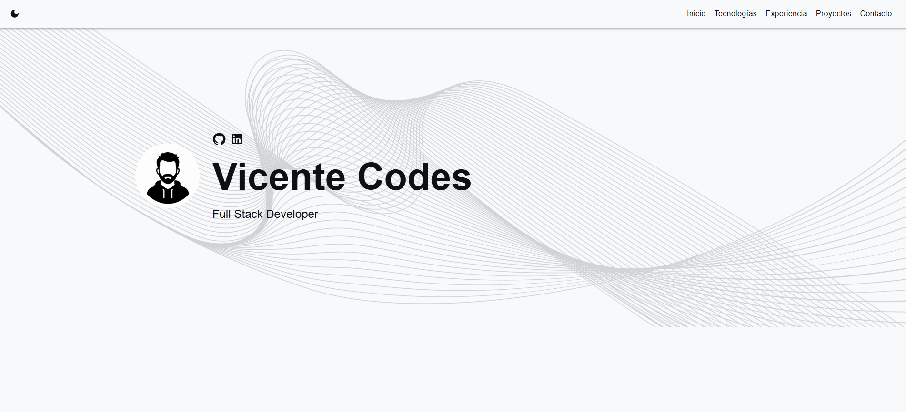

# Portfolio Web — Vicente Codes


Portfolio personal interactivo desarrollado con **React** y **TypeScript**. El proyecto presenta mi perfil, experiencia, habilidades y proyectos mediante una interfaz responsive, navegación SPA, rutas dinámicas y soporte para temas claro y oscuro.

## Demo

🔗 **[Abrir portfolio online →](https://vicente-codes-portfolio-web.vercel.app/)**




---

## Características

- Arquitectura modular basada en componentes React reutilizables.
- Rutas SPA con `react-router-dom` para la página principal y la vista de detalle de cada proyecto.
- Contenido de proyectos centralizado y tipado en `src/data/projects.ts`.
- Diseño responsive con SCSS, transiciones, estados *hover*, sombras y adaptación de tipografías mediante `clamp()`.
- Compatibilidad visual con temas claro y oscuro.
- Galería de proyectos con visualización ampliada de imágenes mediante lightbox.
- Sistema multimedia opcional para mostrar vídeos de recorrido en las páginas de detalle de los proyectos.
- Reproductor de vídeo responsive con imagen `poster`, controles nativos y botón de reproducción superpuesto.
- Formulario de contacto con EmailJS, validación de entradas y medidas de protección frente a envíos automatizados.
- Despliegue automatizado mediante GitHub y Vercel.

---

## Tecnologías

| Categoría | Tecnologías |
| :--- | :--- |
| Frontend | React 18, TypeScript, JavaScript (ES6+) |
| Enrutamiento | React Router DOM v7 |
| Interfaz y estilos | Material UI, SCSS / Sass |
| Multimedia | HTML5 Video, MP4 |
| Integración de email | EmailJS SDK |
| Despliegue | Vercel |
| Herramientas | Node.js, npm, Git |

---

## Estructura del proyecto

```text
.
├── public/                      # Archivos estáticos públicos
│   ├── _redirects               # Reglas de redirección heredadas para Netlify
│   ├── favicon.ico              # Icono principal de la web
│   ├── index.html               # Plantilla HTML principal
│   └── manifest.json            # Metadatos de la Web App
├── src/                         # Código fuente principal
│   ├── assets/                  # Recursos visuales y estilos
│   │   ├── images/              # Avatar, fondos y capturas de proyectos (cc/, vc/)
│   │   ├── styles/              # Hojas de estilo SCSS organizadas por componente
│   │   └── videos/              # Vídeos de proyectos
│   ├── components/              # Componentes de React
│   │   ├── Contact.tsx          # Formulario de contacto con integración de EmailJS
│   │   ├── Expertise.tsx        # Sección de habilidades técnicas
│   │   ├── Main.tsx             # Sección principal / vista de inicio
│   │   ├── Navigation.tsx       # Barra de navegación responsive
│   │   ├── Project.tsx          # Tarjetas y listado de proyectos
│   │   ├── ProjectDetail.tsx    # Galería lightbox y detalle extendido
│   │   └── Timeline.tsx         # Línea de tiempo de experiencia profesional
│   ├── data/                    # Datos estáticos
│   │   └── projects.ts          # Información centralizada y metadatos de proyectos
│   ├── App.tsx                  # Componente raíz y configuración de rutas
│   ├── index.tsx                # Punto de entrada principal de React
│   └── index.scss               # Estilos globales de la aplicación
├── .env.example                 # Plantilla de variables de entorno requeridas
├── .gitignore                   # Archivos e historiales excluidos de Git
├── package.json                 # Dependencias y scripts del proyecto
├── README.md                    # Documentación principal
└── tsconfig.json                # Configuración de TypeScript
```

> El archivo `public/_redirects` forma parte de la estructura original para despliegues en Netlify. El despliegue actual se realiza en Vercel, por lo que no es necesario para el enrutamiento de producción en esta plataforma.

---

## Instalación local

### Requisitos previos

- Node.js 18 o superior
- npm

Puedes comprobar las versiones instaladas con:

```bash
node -v
npm -v
```

### Pasos

1. Clona el repositorio:

```bash
git clone https://github.com/Vicente-codes/vicente-codes-portfolio-web.git
cd vicente-codes-portfolio-web
```

2. Instala las dependencias:

```bash
npm install
```

3. Crea tu archivo de entorno a partir de la plantilla:

```bash
cp .env.example .env
```

4. Completa en `.env` las variables necesarias para EmailJS.

5. Inicia el entorno de desarrollo:

```bash
npm run dev
```

---

## Configuración de EmailJS

1. Crea una cuenta en [EmailJS](https://www.emailjs.com/).
2. Configura un servicio de correo electrónico (*Email Service*).
3. Crea una plantilla con las variables utilizadas por el formulario, por ejemplo: `from_name`, `reply_to` y `message`.
4. Añade el **Service ID**, **Template ID** y **Public Key** a tu archivo `.env`, utilizando los nombres definidos en `.env.example`.

> No subas nunca el archivo `.env` al repositorio. Debe permanecer incluido en `.gitignore`.

---

## Sistema multimedia

Las páginas de detalle admiten vídeos de recorrido de forma opcional. La propiedad `video` del modelo de proyecto no es obligatoria:

```typescript
video?: string;
```

Cuando un proyecto incluye esta propiedad, `ProjectDetail.tsx` muestra un reproductor HTML5 con:

- Imagen `poster` basada en la imagen principal del proyecto.
- Controles nativos de reproducción.
- Carga controlada mediante `preload="none"`.
- Botón de reproducción superpuesto.
- Diseño responsive para escritorio y dispositivos móviles.
- Formato MP4 compatible con navegadores modernos.

Los proyectos que no incluyen la propiedad `video` continúan mostrando su imagen principal mediante el comportamiento original.

---

## Despliegue en Vercel

El proyecto se despliega en **Vercel**. Para desplegarlo desde GitHub:

1. Sube el proyecto a un repositorio de GitHub.
2. Accede a [Vercel](https://vercel.com/) e importa el repositorio.
3. Verifica los comandos detectados por la plataforma, especialmente el comando de instalación y el de compilación definidos en `package.json`.
4. Añade en **Settings > Environment Variables** las mismas variables de EmailJS que utilizas localmente.
5. Ejecuta el despliegue. Vercel generará una URL de producción y volverá a desplegar automáticamente cada cambio enviado a la rama configurada.

Para generar una compilación de producción en local:

```bash
npm run build
```

---

## Créditos

Este proyecto parte de la plantilla open source [react-portfolio-template](https://github.com/yujisatojr/react-portfolio-template), creada por [yujisatojr](https://github.com/yujisatojr).

A partir de esta base, **Vicente Codes** ha reestructurado, rediseñado y ampliado la aplicación con las siguientes implementaciones:

- **Arquitectura modular:** Organización de la interfaz en componentes React reutilizables y centralización tipada de los proyectos en `src/data/projects.ts`.
- **Vistas dinámicas de proyectos:** Rutas y páginas de detalle generadas a partir del `slug` de cada proyecto, con galería de imágenes ampliable.
- **Navegación SPA:** Implementación de rutas con `react-router-dom` v7, desplazamiento suave entre secciones, restauración de scroll y navegación de retorno desde el detalle de proyecto.
- **Estilos y responsive:** Adaptación de SCSS por componentes, mejoras de layout, `clamp()`, `max-width`, transiciones, estados *hover* y compatibilidad con temas claro y oscuro.
- **Integración de Material UI:** Uso de componentes de MUI en botones, campos y modales, coordinados con el sistema visual existente.
- **Optimización y mantenimiento:** Eliminación de recursos, mocks, estilos y efectos redundantes; simplificación del estado y reducción de duplicaciones.
- **Formulario de contacto:** Integración con EmailJS, validación de entradas, sanitización, límites de longitud, campo *honeypot*, control de tasa de envíos y feedback mediante modal.
- **Experiencia de usuario:** Interfaz adaptable a móviles, bloques de contenido diferenciados, interacciones visuales y navegación orientada a facilitar la consulta del portfolio.
- **Sistema multimedia opcional:** Implementación de vídeos de recorrido asociados a cada proyecto mediante una propiedad opcional `video` y renderizado condicional en `ProjectDetail.tsx`.
- **Reproductor responsive:** Uso de HTML5 Video, imagen `poster`, controles nativos, botón de reproducción superpuesto y estilos adaptados a dispositivos móviles.
- **Despliegue:** Integración con GitHub y Vercel para automatizar la compilación y publicación de nuevas versiones.

## Licencia
Este proyecto se distribuye bajo la **Licencia MIT**. Consulta el archivo [LICENSE](./LICENSE) para más detalles.